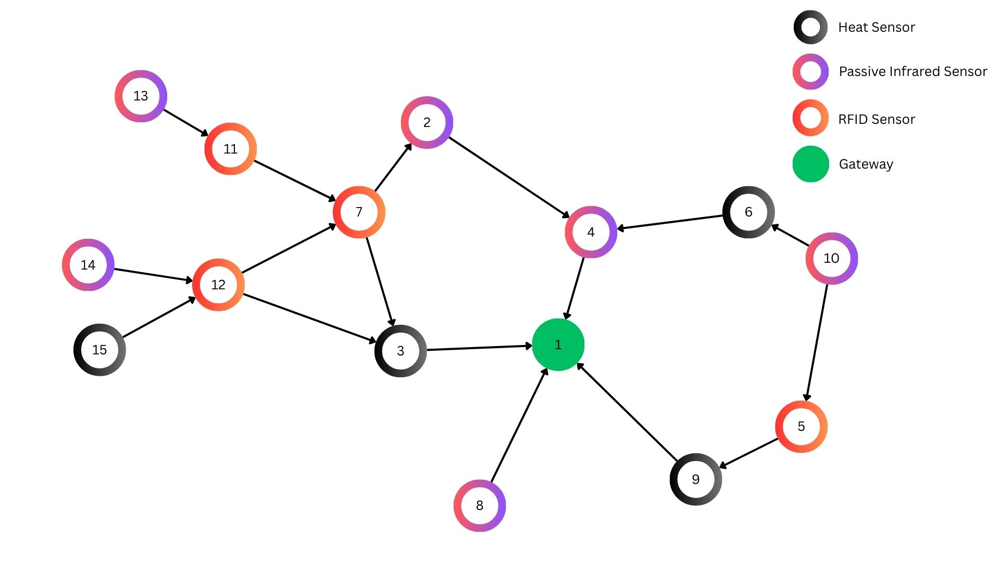

# Information-Driven Adaptation and Entropy-Regularised Planning under Non-Stationarity

**Venue:** Submitted to ACSOS 2026 (under double-blind review)  

---

## Contents

- [Description](#description)
- [File and Folder Structure](#file-and-folder-structure)
- [Environment and Requirements](#environment-and-requirements)
- [Setup and Execution](#setup-and-execution)
- [Configuration (solver.config)](#configuration-srcsolverconfig)
- [Main Output Files](#main-output-files)
- [Generating Charts](#generating-charts)
- [Reproducing Paper Figures](#reproducing-paper-figures)
- [Troubleshooting](#troubleshooting)
- [License and Citation](#license-and-citation)

---

## Description

This artifact provides the Java and Python implementation that accompanies the above paper. It implements a POMDP-based self-adaptive controller for the **DeltaIoT** IoT sensor network — a 15-mote multi-hop network of RFID, passive-infrared, and temperature sensors. At each timestep the managing system selects a per-mote transmission power action (**DTP**: decrease, **ITP**: increase) to jointly satisfy two non-functional requirements (NFRs): Minimisation of Energy Consumption (**MEC**, in Coulombs) and Reduction of Packet Loss (**RPL**, ratio).

Two algorithmic contributions are implemented:

**ERPerseus** — an entropy-regularised Perseus POMDP solver. In the standard Perseus backup step, the argmax over action Q-values is replaced by a temperature-controlled softmax. The temperature parameter `lambda` controls the degree of entropy regularisation: `lambda=0` reduces exactly to standard Perseus (argmax); larger `lambda` distributes action probability more uniformly, preventing premature commitment under uncertain value estimates.

**MIP (Mutual Information Progress)** — a runtime belief-update signal used inside the MAPE-K Analyse phase. MIP measures the change in per-mote mutual information over a lookback window of `m` timesteps. It is used as the surprise signal `S` in the SMiLe (Surprise Minimisation Learning) gamma formula, which determines how strongly the current transition belief is blended toward a flat prior after each observation. This distinguishes genuine epistemic learning from aleatory noise.

Experiments are conducted using the DeltaIoT discrete-event simulator under controlled link failures and progressively tightened NFR constraints. Results are averaged over three independent seeds (222, 223, 224) with 500 timesteps per run. See [REPRODUCIBILITY.md](docs/REPRODUCIBILITY.md) for step-by-step instructions to reproduce all paper results.


---

## File and Folder Structure

| Path | Purpose |
|------|---------|
| `src/main/SolvePOMDP.java` | Entry point. Implements the 500-timestep MAPE-K loop, reads `solver.config`, connects the POMDP solver to the DeltaIoT simulator, and invokes chart generation on completion. |
| `src/solver/ERPerseus.java` | ERPerseus solver: point-based value iteration with entropy-regularised (softmax) backup at both the observation and action levels, controlled by `lambda`. |
| `src/solver/Perseus.java` | Baseline Perseus solver: standard point-based value iteration with argmax backup (equivalent to ERPerseus with `lambda=0`). |
| `src/iot/DeltaIOTConnector.java` | Connects the POMDP to the DeltaIoT simulator. Implements MIP computation (`calculateAndStoreMIS`), the SMiLe belief update rule, and the CC and BF surprise alternatives. |
| `src/pomdp/POMDP.java` | POMDP formalism: states, actions, observations, transition and observation beliefs (Dirichlet pseudo-counts), discount factor. |
| `src/solver.config` | Master configuration file. Edit before running, or pass a path via `-DconfigPath`. |
| `domains/IoT.POMDP` | POMDP domain: 4 states (S1–S4), 2 actions (DTP, ITP), 3 observations (SNR-L, SNR-E, SNR-G), reward table. |
| `libraries/` | Required JARs: `Simulator.jar` (DeltaIoT), `antlr-runtime-3.5.2.jar`, `commons-math3-3.6.1.jar`, `gurobi-10.0.3.jar`, `jfreechart-1.5.3.jar`, `joptimizer-4.0.0.jar`, `json-simple-4.0.1.jar`, `jython-standalone-2.7.4.jar`, `libpomdp-parser-1.0.0.jar`, `log4j-api-2.24.3.jar`, `lpsolve-5.5.2.0.jar`, `mtj-1.0.4.jar` |
| `scripts/run_ablation.py` | Ablation orchestrator. Runs all experiments across lambda, p_c, lookback, NFR threshold, and link-failure factor levels over multiple seeds and surprise measures; writes summary CSVs and figures. |
| `scripts/init_solver_config.py` | Interactive configuration wizard. Writes per-seed `solver.config` files. |
| `scripts/config_utils.py` | Shared configuration I/O utilities (required by other scripts). |
| `createCharts.py` | Chart generator: MEC/RPL time series, MIP bounds, gamma, surprise plots, and interactive Dash mote-metrics app. |
| `requirements.txt` | Pinned Python dependency list. |
| `output_dir/` | Default output directory (created on first run). |
| `output_dir/results/configs/` | Generated per-run configuration files. |
| `output_dir/results/init_runs/` | Per-seed main result directories (`s222/`, `s223/`, `s224/`). |
| `output_dir/results/abl1_lambda/` | Lambda ablation outputs; subdirectories: `<surprise>/<run_id>/` |
| `output_dir/results/abl2_pc/` | p_c ablation outputs. |
| `output_dir/results/abl3_lookback/` | Lookback ablation outputs. |
| `output_dir/results/abl4_nfr/` | NFR threshold tightening ablation outputs. |
| `output_dir/results/abl5_disaster/` | Link-failure scenario ablation outputs. |
| `output_dir/results/summary_*.csv` | Aggregated per-run and seed-averaged statistics. |
| `output_dir/results/figures/` | Generated ablation plots (PNG). |
| `docs/` | Internal algorithm descriptions and pseudocode (developer notes). |
| `log4j2.xml` | Log4j 2 console logging configuration. |

---

## Environment and Requirements

**Hardware:** Any modern 64-bit machine with at least 8 GB RAM. No GPU required. A single 500-timestep run completes in approximately 5–10 minutes. The full ablation suite (all five ablations, four surprise variants, three seeds) requires several hours of CPU time.

**Software:**

| Item | Minimum | Tested |
|------|---------|--------|
| Java | JDK 8 | OpenJDK / Oracle JDK 17 |
| Python | 3.7 | 3.10, 3.11 |

**Python packages** (full pinned list in `requirements.txt`): matplotlib 3.10.8, pandas 2.3.3, numpy 2.3.5, plotly 6.5.0, dash 3.3.0, loguru 0.7.3, plus transitive dependencies.

**Platform:** Commands below use Unix forward-slash paths and Bash syntax. On Windows Command Prompt, replace `:` with `;` in Java `-cp` arguments. On Windows Git Bash, quote the `-cp` value (e.g. `".;bin;libraries/*"`) to prevent `;` being treated as a command separator.

---

## Setup and Execution

All commands are run from the `L4Project/` project root.

### 1. Verify Java

```bash
java -version
javac -version
```

Both should report version 8 or later.

### 2. Python environment

```bash
python -m venv .venv
# Windows:   .venv\Scripts\activate
# Linux/Mac: source .venv/bin/activate
pip install -r requirements.txt
```

### 3. Compile Java source

```bash
# Linux/Mac
javac -cp "libraries/*" -d bin -sourcepath src \
  src/main/*.java src/pomdp/*.java src/solver/*.java src/iot/*.java
```

On Windows Command Prompt:

```
javac -cp "libraries\*" -d bin -sourcepath src ^
  src\main\*.java src\pomdp\*.java src\solver\*.java src\iot\*.java
```

### 4. Configure

**Option A — interactive wizard (recommended):**

```bash
python scripts/init_solver_config.py
```

You will be prompted for: `algorithmType`, `lambda`, number of runs and seeds, `surpriseMeasureForGamma`, `useSurpriseUpdating`, `p_c`, `lookback`, `mecThreshold`, `rplThreshold`, and optional link failure parameters. The wizard writes `src/solver.config` and, for multiple seeds, per-seed configs under `output_dir/results/configs/`.

**Option B — edit `src/solver.config` directly.** See [Configuration](#configuration-srcsolverconfig) below.

### 5. Run the solver

```bash
# Linux/Mac
java -cp ".:bin:libraries/*" main.SolvePOMDP

# Windows Command Prompt
java -cp ".;bin;libraries\*" main.SolvePOMDP
```

To use a specific configuration file:

```bash
java -DconfigPath=output_dir/results/configs/run_s222.config \
     -cp ".:bin:libraries/*" main.SolvePOMDP
```

To run multiple seeds sequentially (Bash):

```bash
for s in 222 223 224; do
  java -DconfigPath="output_dir/results/configs/run_s${s}.config" \
       -cp ".:bin:libraries/*" main.SolvePOMDP
done
```

To suppress automatic chart generation:

```bash
java -DnoPlots=true -cp ".:bin:libraries/*" main.SolvePOMDP
```

On completion, output files are written to the directory set by `outputDirectory` in the config (default: `output_dir/`).

---

## Configuration (`src/solver.config`)

### General Settings

| Setting | Role | Default |
|---------|------|---------|
| `algorithmType` | Solver: `erperseus`, `perseus`, `erpbvi`, `faserpbvi` | `erperseus` |
| `lambda` | Entropy temperature (≥0); 0.0 = standard Perseus | `1.0` |
| `outputDirectory` | Directory for output files | `output_dir` |
| `domainDirectory` | Directory containing `.POMDP` files | `domains` |
| `valueFunctionTolerance` | Convergence threshold | `0.000001` |
| `timeLimit` | Maximum runtime in seconds | `1000` |

### Approximate Algorithm Settings

| Setting | Role | Default |
|---------|------|---------|
| `beliefSamplingRuns` | Number of belief-sampling trajectories | `10` |
| `beliefSamplingSteps` | Steps per trajectory | `200` |

### Experiment Parameters

| Setting | Role | Default |
|---------|------|---------|
| `runSeed` | Random seed; vary for independent runs (e.g. 222, 223, 224) | `222` |
| `surpriseMeasureForGamma` | Surprise signal: `MIS`, `CC`, or `BF` | `MIS` |
| `useSurpriseUpdating` | `true` = SMiLe updates; `false` = classic Bayesian | `true` |
| `p_c` | Volatility in (0,1); `m = p_c/(1-p_c)` | `0.5` |
| `lookback` | Lookback window `m` for MIP (integer ≥ 1) | `4` |
| `mecThreshold` | MEC satisfaction threshold (Coulombs) | `20` |
| `rplThreshold` | RPL satisfaction threshold (ratio) | `0.2` |

### Link Failure Injection (Optional)

| Setting | Role | Default |
|---------|------|---------|
| `linkFailureTimestep` | Timestep at which to disable listed links (leave empty to disable) | — |
| `linkFailureLinks` | Comma-separated link IDs, e.g. `12-7,12-3` | — |
| `linkRecoveryTimestep` | Timestep at which to re-enable links (leave empty for permanent failure) | — |

---

## Main Output Files

| File | Content |
|------|---------|
| `MECSattimestep.txt` | Energy consumption (Coulombs) per timestep. Two columns: `timestep value`. |
| `RPLSattimestep.txt` | Packet-loss ratio per timestep. Same two-column format. |
| `gamma.txt` | SMiLe mixing factor γ per mote per timestep. |
| `surpriseMIS.txt` | MIP surprise value per mote per timestep. |
| `surpriseCC.txt` | CC surprise value per mote per timestep. |
| `surpriseBF.txt` | BF surprise value per mote per timestep. |
| `MISBounds.txt` | Theorem 1 confidence interval bounds. Three columns: `timestep lowerBound upperBound`. |
| `SelectedAction.txt` | DTP or ITP action selected each timestep. |
| `mote_metrics.txt` | Per-mote/per-link SNR, power, distribution factor, spreading factor. |
| `IoT.alpha` | Converged alpha vectors (value function). |

---

## Generating Charts

When the solver runs, `createCharts.py` is invoked automatically with the `outputDirectory`, `mecThreshold`, and `rplThreshold` from the active config. To run charts by hand or target a specific run directory:

```bash
python createCharts.py \
  --output-dir output_dir/results/init_runs/s222 \
  --mec-threshold 20 \
  --rpl-threshold 0.2
```

`--output-dir` must point **directly** to the folder containing the solver output `.txt` files, not a parent directory. `--mec-threshold` and `--rpl-threshold` set the red threshold lines on the MEC and RPL plots; use the same values as the config that produced the run.

Charts produced:
- MEC and RPL satisfaction time series with threshold lines
- MIP bounds (Theorem 1 confidence intervals)
- Gamma and surprise measure time series per mote
- Interactive Dash app for per-mote metrics (opens in browser)

---

## Reproducing Paper Figures

This section gives the exact commands and configuration needed to reproduce **Figure 1** and **Figure 2** from the paper.

---

### Figure 1 — ERPerseus MEC/RPL time series

Figure 1 shows the standardised value of surprise over 500 timesteps under MIP updating. The exact configuration used is reproduced below.

**Step 1 — write `src/solver.config` with these values:**

```ini
outputDirectory=output_dir
domainDirectory=domains

algorithmType=erperseus
lambda=0.1

runSeed=222
surpriseMeasureForGamma=MIS
p_c=0.25
useSurpriseUpdating=true
lookback=5

mecThreshold=17.0
rplThreshold=0.17

linkFailureTimestep=
linkFailureLinks=
linkRecoveryTimestep=

valueFunctionTolerance=0.000001
timeLimit=1000

beliefSamplingRuns=10
beliefSamplingSteps=200

dumpPolicyGraph=false
dumpActionLabels=true
```

**Step 2 — compile (if not already done):**

```bash
# Linux/Mac
javac -cp "libraries/*" -d bin -sourcepath src \
  src/main/*.java src/pomdp/*.java src/solver/*.java src/iot/*.java
```

**Step 3 — run the solver:**

```bash
# Linux/Mac
java -cp ".:bin:libraries/*" main.SolvePOMDP

# Windows Command Prompt
java -cp ".;bin;libraries\*" main.SolvePOMDP
```

Charts are generated automatically on completion (lots of other useful charts will also be provided once simulation ends). To regenerate them manually from the output files:

```bash
python createCharts.py \
  --output-dir output_dir \
  --mec-threshold 17.0 \
  --rpl-threshold 0.17
```

The plots in `output_dir/` correspond to Figure 1.

---

### Figure 2 — ERPerseus vs Perseus comparison

Figure 2 compares ERPerseus and baseline Perseus under identical conditions. The seeds for the two compared runs are stored in `output_dir/compare/` (`erperseus.config` and `perseus.config`) and their outputs in `output_dir/compare/erperseus/` and `output_dir/compare/perseus/`. The output animation figures are under `output_dir/compare/.../state_transitions`. View them in the browser using Live Server, or another appropriate html viwer.

**Step 1 — run ERPerseus:**

```bash
# Linux/Mac
java -DconfigPath=output_dir/compare/erperseus.config \
     -cp ".:bin:libraries/*" main.SolvePOMDP

# Windows Command Prompt
java -DconfigPath=output_dir\compare\erperseus.config \
     -cp ".;bin;libraries\*" main.SolvePOMDP
```

Key settings in `output_dir/compare/erperseus.config`:

| Parameter | Value |
|-----------|-------|
| `algorithmType` | `erperseus` |
| `lambda` | `1.0` |
| `runSeed` | `222` |
| `surpriseMeasureForGamma` | `MIS` |
| `useSurpriseUpdating` | `true` |
| `p_c` | `0.5` |
| `lookback` | `4` |
| `mecThreshold` | `20` |
| `rplThreshold` | `0.2` |

**Step 2 — run Perseus (baseline):**

```bash
# Linux/Mac
java -DconfigPath=output_dir/compare/perseus.config \
     -cp ".:bin:libraries/*" main.SolvePOMDP

# Windows Command Prompt
java -DconfigPath=output_dir\compare\perseus.config \
     -cp ".;bin;libraries\*" main.SolvePOMDP
```

The Perseus config is identical except `algorithmType=perseus`.

**Step 3 — generate charts for each run:**

```bash
python createCharts.py \
  --output-dir output_dir/compare/erperseus \
  --mec-threshold 20 \
  --rpl-threshold 0.2

python createCharts.py \
  --output-dir output_dir/compare/perseus \
  --mec-threshold 20 \
  --rpl-threshold 0.2
```

Place the two resulting MEC/RPL plots side by side to reproduce Figure 2. The pre-computed outputs from our runs are already present in `output_dir/compare/erperseus/` and `output_dir/compare/perseus/` for direct comparison without re-running.

---

### Substituting your own method

To compare an alternative algorithm against either figure, produce `MECSattimestep.txt` and `RPLSattimestep.txt` files in the two-column `timestep value` format used by the solver (see [Main Output Files](#main-output-files)), place them in a directory of your choice, and run:

```bash
python createCharts.py \
  --output-dir <your-output-dir> \
  --mec-threshold <threshold> \
  --rpl-threshold <threshold>
```

Use the same threshold values as the figure you are comparing against (17.0 / 0.17 for Figure 1; 20 / 0.2 for Figure 2) so the threshold lines align.

---

## Troubleshooting

**`solver.config` or `domains/IoT.POMDP` not found**  
Run from `L4Project/` (project root), not from a subdirectory.

**`ClassNotFoundException` / missing Simulator or deltaiot classes**  
Ensure all JARs in `libraries/` are on the classpath. If `libraries/*` does not expand, list JARs explicitly in the `-cp` argument.

**Charts not opening**  
Activate the venv and run `pip install -r requirements.txt`. Then run `createCharts.py` manually after a completed run (see above). If the Dash app does not open, copy the printed localhost URL into a browser.

**`createCharts.py` KeyError: 'timestep' or empty data**  
`--output-dir` is pointing to a parent directory rather than directly to the folder containing `MECSattimestep.txt`. Correct the path.

**Bash: classpath with semicolons**  
On Git Bash or other Unix shells, always quote the classpath: `-cp ".;bin;libraries/*"`.


Sometimes, but rarely, some of the graphs produced post run don't display, and result in a localhost error. If this is the case, just re-run the experiment and the next batch of results should output fine.
---

## License

**License:** GNU General Public License v3.0 (GPL-3.0).  
See <https://www.gnu.org/licenses/gpl-3.0.html>

This artifact builds upon the SolvePOMDP open-source library (GPL-3.0) and the DeltaIoT simulator. Third-party JAR files in `libraries/` are subject to their respective licenses; see each library's project page for details.
