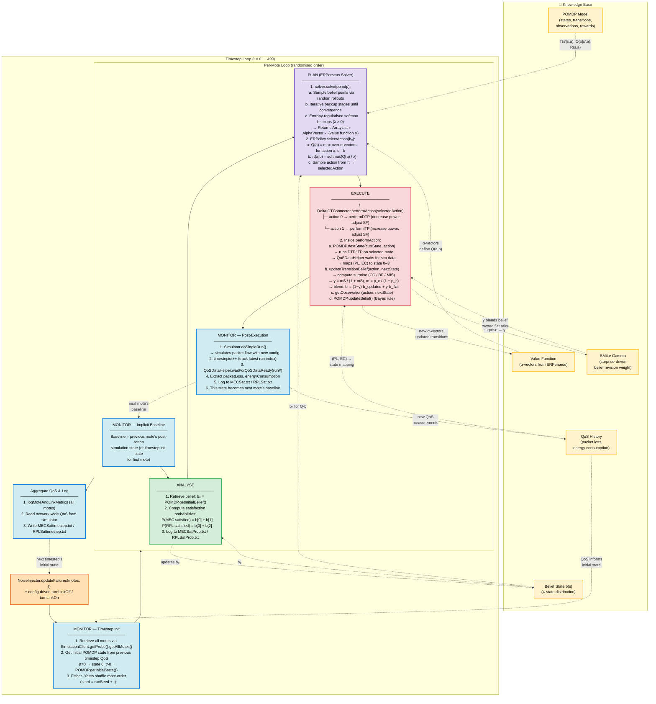
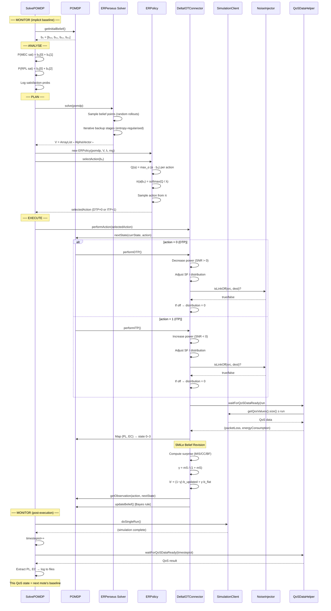
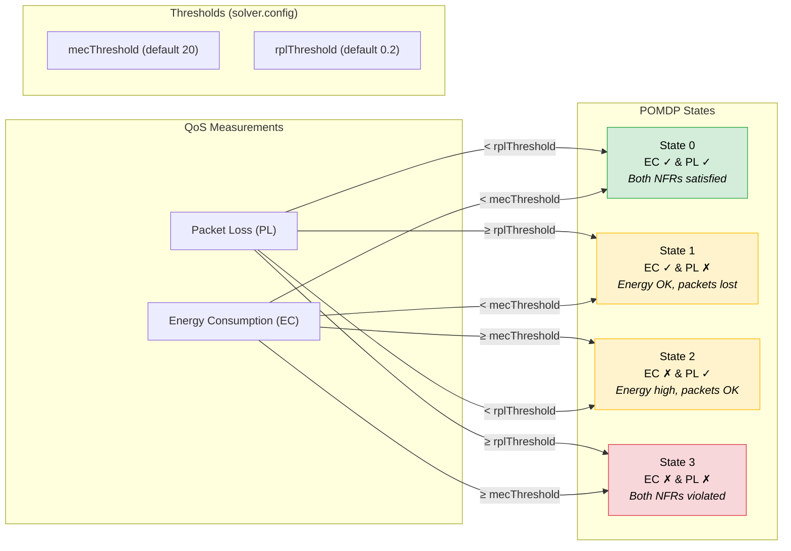
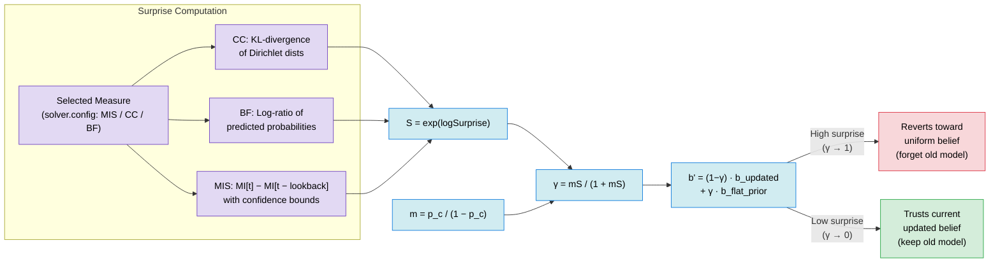
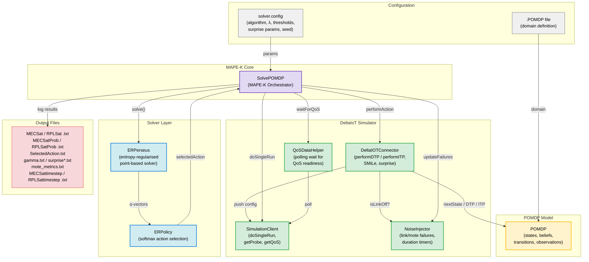

# MAPE-K Loop — DeltaIoT Self-Adaptive POMDP Framework

## High-Level MAPE-K Cycle

## Detailed Sequence — Single Mote Adaptation (ERPerseus)

## State Discretisation

## SMiLe Belief Revision (Knowledge Update)

## External Component Interactions

