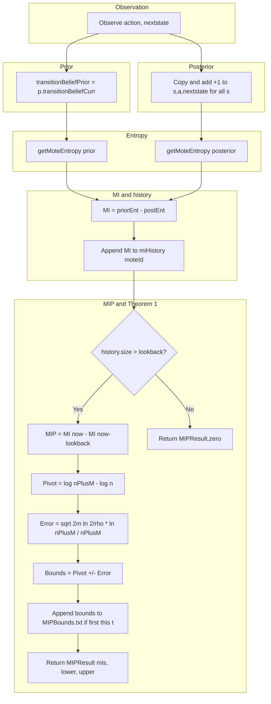

# Mutual Information Surprise (MIP) – Detailed Pseudocode

**Source:** [DeltaIOTConnector.java](../src/iot/DeltaIOTConnector.java) (lines 261–302, 406–425, 440–495)  
**Paper:** Wang et al., *Mutual Information Surprise: Rethinking Unexpectedness in Autonomous Systems*, arXiv:2508.17403, 2025.  
**URL:** <https://www.arxiv.org/pdf/2508.17403>

---

## 1. Role of MIP in This Codebase

MIP is used inside **`updateTransitionBelief`** when the surprise measure is set to `"MIP"`. Each time a transition `(action, nextstate)` is observed, the connector:

1. Updates Dirichlet counts with +1.0 for that transition (prior → posterior).
2. Computes MIP via **`calculateAndStoreMIP`** (prior = current belief, posterior = belief after +1.0).
3. Converts MIP into a **SMiLe gamma** (learning rate):
   - **MIP &lt; 0** (stalled learning / exploitation): lower gamma → more blending toward a flat prior, encouraging exploration.
   - **MIP &gt; 0** (extra learning / exploration): higher gamma → less blending, continuing to exploit the current transition belief.

Thus, in this connector MIP acts as a **learning-progression signal** that modulates how much the transition belief is shifted toward a vague prior vs. kept close to the count-updated belief, in the spirit of the paper’s *enlightenment vs. frustration* and the MIP Reaction Policy (MIPRP).

---

## 2. Variable Glossary

| Variable | Type | Meaning |
|----------|------|---------|
| `transitionBeliefPrior` | `double[state][action][nextState]` | Dirichlet parameters for transitions **before** the +1.0 update for the observed `(action, nextstate)`. |
| `transitionBeliefPosterior` | `double[state][action][nextState]` | Same structure **after** adding +1.0 to `[s][action][nextstate]` for all `s`. |
| `action` | `int` | Action taken (e.g. DTP / ITP). |
| `nextstate` | `int` | Observed next state. (Not used inside `getMoteEntropy`; entropy is over the full next-state distribution.) |
| `moteId` | `int` | Mote identifier; used to key a per-mote MI history. |
| `timestep` | `int` | Current simulation timestep; used for logging MIP bounds. |
| `priorEntropy` | `double` | Expected entropy of the transition belief **before** observing the transition. |
| `posteriorEntropy` | `double` | Expected entropy **after** the +1.0 update. |
| `mutualInformation` | `double` | `priorEntropy - posteriorEntropy`; one-step information gain from the observed transition. Treated as **Î** (MI estimate) for this timestep. |
| `miHistory` | `Map<moteId, List<double>>` | For each mote, ordered list of MI values (one per call to `calculateAndStoreMIP`). Index `i` corresponds to the Î after the `(i+1)`-th observation. |
| `lookback` | `int` | Number of steps between the two MI estimates used in MIP. Default **4**. Corresponds to **m** in the paper. |
| `n` | `int` | `history.size() - lookback`. Index/ count of “older” observations for the *earlier* MI estimate Î_n. |
| `m` | `int` | `lookback`. Number of “new” observations between Î_n and Î_{n+m}. |
| `nPlusM` | `int` | `history.size()`. Total observations for the *current* MI estimate Î_{n+m}. |
| `pivotVal` | `double` | Expected MIP under the *well-regulated* null: **log(n+m) − log(n)** (paper, undersampled case). |
| `errorTerm` | `double` | Half-width of the Theorem 1 confidence interval: √(2m ln(2/ρ)) · ln(n+m) / (n+m). |
| `rho` | `double` | Miscoverage; 1−ρ is the confidence level. Set to **0.05** (95% confidence). |
| `lowerBound`, `upperBound` | `double` | `pivotVal ∓ errorTerm`. Theorem 1 bounds for Î_{n+m} − Î_n. |
| `MIPResult` | record | `{ mis, lowerBound, upperBound }`. `MIPResult.zero()` = `(0, 0, 0)`. |
| `alpha` | `double[]` | Dirichlet parameters for one (state, action) → next-state distribution. |
| `alpha0` | `double` | Sum of `alpha`. |
| `k` | `int` | Length of `alpha` (number of next states). |

---

## 3. Helper: Dirichlet Entropy

**Function:** `dirichlet_entropy(alpha)`

**Reference:** Standard entropy of a Dirichlet distribution.  
**Formula:**  
H(Dir(α)) = ln B(α) + (α₀ − k) ψ(α₀) − ∑ᵢ (αᵢ − 1) ψ(αᵢ)  
with α₀ = ∑ᵢ αᵢ, k = |α|, ψ = digamma, B(α) = ∏ᵢ Γ(αᵢ) / Γ(α₀).

```
FUNCTION dirichlet_entropy(alpha: array of double) -> double
    alpha0 := sum(alpha)
    k := length(alpha)

    lnB := 0
    FOR each a in alpha:
        lnB += logGamma(a)
    lnB -= logGamma(alpha0)

    sum1 := 0
    FOR each a in alpha:
        sum1 += (a - 1) * digamma(a)

    sum2 := (alpha0 - k) * digamma(alpha0)

    RETURN lnB + sum2 - sum1
```

---

## 4. Helper: Mote Entropy (Expected Entropy of Transition Belief)

**Function:** `getMoteEntropy(transitionBelief, action, nextstate) -> double`

**Role:** Computes the **expected entropy** of the transition model over the current **state belief**. For each state `s`, the transition (s, `action`) → next states is a Dirichlet; its entropy is weighted by the current belief that the system is in `s`. The `nextstate` argument is not used; entropy is over the full next-state distribution for `(s, action)`.

**Note:** `getInitialBelief()` returns the *current* state belief (updated each step), despite the name.

```
FUNCTION getMoteEntropy(transitionBelief: double[state][action][nextState],
                       action: int, nextstate: int) -> double
    entropy := 0
    belief := p.getInitialBelief()   // current state belief

    FOR stateIndex := 0 TO numStates - 1:
        // Dirichlet params for (stateIndex, action) -> all next states
        alpha := transitionBelief[stateIndex][action]   // 1D array over nextState
        H := dirichlet_entropy(alpha)
        w  := belief.getBelief(stateIndex)
        entropy += w * H

    RETURN entropy
```

---

## 5. Main: Calculate and Store MIP

**Function:** `calculateAndStoreMIP(transitionBeliefPrior, transitionBeliefPosterior, action, nextstate, moteId, timestep) -> MIPResult`

**Paper:**  
- **MIP definition (Eq. 4):** MIP ≜ Î_{n+m} − Î_n.  
- **Theorem 1 (undersampled, n ≪ |X|,|Y|):** With probability ≥ 1−ρ,  
  Î_{n+m} − Î_n ∈ ( log(n+m) − log(n) ) ± ( √(2m ln(2/ρ)) · ln(n+m) ) / (n+m).

**Î in this implementation:** For each transition observation, Î is the one-step **information gain**  
Î = H(prior) − H(posterior),  
i.e. the decrease in expected entropy of the transition belief after the +1.0 update. The sequence of Î values is stored in `miHistory[moteId]`; the “n” and “n+m” in the paper correspond to positions in that history (see below).

```
FUNCTION calculateAndStoreMIP(transitionBeliefPrior, transitionBeliefPosterior,
                             action, nextstate, moteId, timestep) -> MIPResult

    // --- Step 1: Prior entropy (before +1.0 update) ---
    priorEntropy := getMoteEntropy(transitionBeliefPrior, action, nextstate)

    // --- Step 2: Posterior entropy (after +1.0 for (s,action,nextstate) for all s) ---
    posteriorEntropy := getMoteEntropy(transitionBeliefPosterior, action, nextstate)

    // --- Step 3: One-step mutual information (information gain) ---
    // MI = H(prior) - H(posterior). This is the Î for this timestep.
    mutualInformation := priorEntropy - posteriorEntropy

    // --- Step 4: Per-mote MI history ---
    IF moteId NOT IN miHistory:
        miHistory[moteId] := new empty list of double
    history := miHistory[moteId]
    APPEND mutualInformation TO history

    // --- Step 5: MIP and Theorem 1 bounds (only if enough history) ---
    // Need at least (lookback + 1) entries: index (size-1) and (size-1-lookback).
    IF length(history) <= lookback:
        RETURN MIPResult.zero()   // (mis=0, lowerBound=0, upperBound=0)

    // --- Step 6: MIP = Î_{n+m} − Î_n (paper Eq. 4) ---
    // Mapping: Î_n      <- history[size-1-lookback]  (earlier)
    //          Î_{n+m}  <- history[size-1]          (current)
    // Here m = lookback, n = size - lookback (number of observations for Î_n).
    mis := history[length(history)-1] - history[length(history)-1 - lookback]

    // --- Step 7: Theorem 1 bounds ---
    n      := length(history) - lookback   // “older” observation count
    m      := lookback                     // “new” observation count (paper m)
    nPlusM := length(history)              // total for current Î

    rho := 0.05   // 1−ρ = 0.95 confidence

    // Pivot (expected MIP under well-regulated system, undersampled case)
    pivotVal := ln(nPlusM) - ln(n)

    // Half-width of the interval (paper Theorem 1)
    errorTerm := sqrt(2 * m * ln(2 / rho)) * ln(nPlusM) / nPlusM

    lowerBound := pivotVal - errorTerm
    upperBound := pivotVal + errorTerm

    // --- Step 8: Optional logging (at most once per timestep) ---
    IF timestep > lastBoundsTimestep:
        appendMIPBoundsToFile(timestep, lowerBound, upperBound)
        lastBoundsTimestep := timestep

    RETURN MIPResult(mis, lowerBound, upperBound)
```

**Oversampled case (paper):** For n ≫ |X|,|Y| the expectation becomes (|Y|−1)(1/n − 1/(n+m)). This code does **not** implement that; it uses only the undersampled pivot log(n+m)−log(n).

---

## 6. Helper: Append MIP Bounds to File

**Function:** `appendMIPBoundsToFile(timestep, lowerBound, upperBound)`

Appends one line to `outputDirectory/MIPBounds.txt`:

```
timestep  lowerBound  upperBound
```

---

## 7. Call Site and Data Flow

**Where it is called (inside `updateTransitionBelief`):**

- `transitionBeliefPrior`  := `p.transitionBeliefCurr` (current belief **before** any +1.0).
- `transitionBeliefPosterior` := deep copy of `p.transitionBeliefCurr` with +1.0 added to  
  `[stateIndex][action][nextstate]` for every `stateIndex`.

So:

- **Prior entropy:** expected entropy of the transition belief before the observed transition.
- **Posterior entropy:** expected entropy after the Bayesian +1.0 update for that transition.
- **Î = priorEntropy − posteriorEntropy:** information gain from that one observation.
- **MIP:** change in such Î over a window of `lookback` steps (Î_current − Î_{current−lookback}).

---

## 8. End-to-End Flow (Mermaid)



---

## 9. Summary of “Δ in This Implementation

| Paper | This implementation |
|-------|---------------------|
| Î_n, Î_{n+m} | MLE-style estimates of mutual information. |
| Î | For each transition, **Î = H(prior) − H(posterior)**. The “prior” and “posterior” are the Dirichlet transition beliefs before and after the +1.0 update. H is the expected Dirichlet entropy over the current state belief. |
| n | Number of MI samples in the “earlier” window: `history.size() - lookback`. |
| m | `lookback` (default 5): number of MI samples between Î_n and Î_{n+m}. |

So the time series of Î is the sequence of *per-observation information gains* from the transition belief update; MIP is the change in that gain over a window of `lookback` steps, and the Theorem 1 bounds are used to decide whether that change is within the expected range for a well-regulated system.
